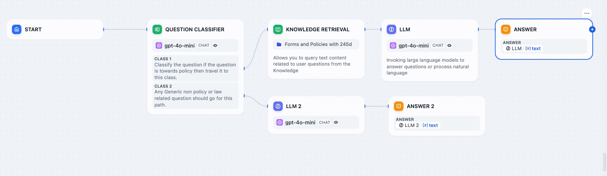

# Minn-AI

**Minn-AI** is a tool designed to track changes to a website. The system:
- Tracks textual updates while ignoring dynamic/script-based changes.
- Provides a REST API for integration.
- Logs changes and responses for reference.

--- 

## Features

- **Textual Change Detection**: Ignores scripts/dynamic content.
- **API-Driven Architecture**: Easily integrates with existing systems.
- **Scheduler**: Automatically monitors websites every 5 minutes.
- **Logs**: Comprehensive records for debugging.

---

## API Endpoints

### POST /check
**Description**: Checks if the provided URL has been updated.

#### Request Example:
Content-Type: `application/json`

```json
{
  "url": "https://example.com"
},
{
  "status": "unchanged",
  "hash": "previous_hash"
},
{
  "status": "updated",
  "hash": "new_hash"
}
```


### Section 4:Installation Instructions

## Installation

### Prerequisites
- Python 3.10+
- Flask (`pip install flask`)
- Requests (`pip install requests`)
- BeautifulSoup (`pip install beautifulsoup4`)
- Bash (for automation)

### Steps
1. Clone the repository:
    ```bash
    git clone https://github.com/your-repo/website-update-monitor.git
    cd website-update-monitor
    ```

2. Install dependencies:
    ```bash
    pip install -r requirements.txt
    ```

3. Start the API:
    ```bash
    python app.py
    ```

4. Run the scheduler script:
    ```bash
    ./website_monitor.sh
    ```

---
## How It Works



1. **Textual Content Hashing**:
    - Extracts plain text using `BeautifulSoup` while ignoring scripts/dynamic elements.
    - Generates and compares hashes to detect meaningful updates.

2. **Scheduler**:
    - Periodically invokes the API every 5 minutes using `curl`.

3. **Logs**:
    - API responses are logged in `website_monitor.log`.

---
## How to run
- 1. Clone the repository
```bash
    git clone "https://github.com/Sanyam8055/ai_compliance"
```

- 2.Install dependencies
```bash
    pip install requirements.txt
```

- 3.Run the application
```bash
python app.py
```

## Technology Stack

- **Backend**: Python (Flask)
- **Frontend**: Bash
- **Hashing**: Python `hashlib`
- **HTML Parsing**: `BeautifulSoup`


## License

This project is licensed under the MIT License. See the `LICENSE` file for details.


## Contributing

Contributions are welcome! Feel free to submit a pull request or raise an issue for enhancements.

