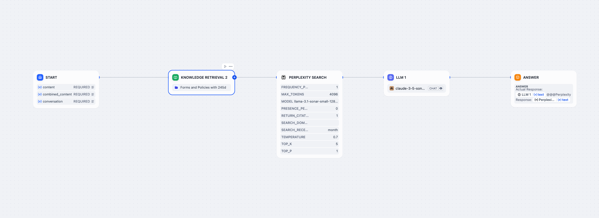
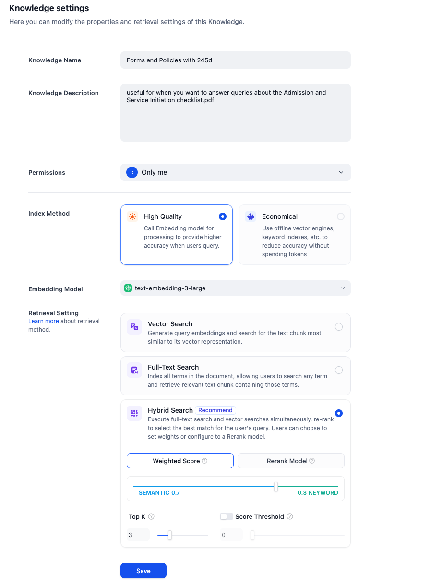

# MinnAI

**MinnAI** is a comprehensive regulatory compliance platform designed to simplify the compliance process for AI agents. It offers proactive monitoring, easy compliance checks, and future-proof design to adapt to the evolving AI landscape.

---

## Features

- **Proactive Monitoring**: Actively monitors AI systems to ensure compliance before issues arise.
- **Easy Compliance Checks**: Upload documents for instant analysis and compliance validation.
- **Future-Proof Design**: Built with scalability in mind, adapting to the evolving AI landscape.
- **Real-Time Law Monitoring**: Automatically tracks updates to statutes and regulations from official sources.
- **Continuous Updates**: Get notified about changes to compliance standards and laws in real-time.

---

## API Endpoints

### POST /check
**Description**: Checks if the provided URL has been updated.

#### Request Example:
Content-Type: `application/json`

```json
{
  "url": "https://example.com"
}
```

#### Response Example:
```json
{
  "status": "unchanged",
  "hash": "previous_hash"
}
```
or
```json
{
  "status": "updated",
  "hash": "new_hash"
}
```

---

## Installation

### Prerequisites
- Python 3.10+
- Flask (`pip install flask`)
- Requests (`pip install requests`)
- BeautifulSoup (`pip install beautifulsoup4`)
- MongoDB (`pip install pymongo`)
- Bash (for automation)

### Steps
1. Clone the repository:
    ```bash
    git clone https://github.com/your-repo/website-update-monitor.git
    cd website-update-monitor
    ```

2. Install dependencies:
    ```bash
    pip install -r requirements.txt
    ```

3. Start the API:
    ```bash
    python main.py
    ```

4. Run the scheduler script:
    ```bash
    ./website_monitor.sh
    ```

---

## How It Works



1. **Textual Content Hashing**:
    - Extracts plain text using `BeautifulSoup` while ignoring scripts/dynamic elements.
    - Generates and compares hashes to detect meaningful updates.

2. **Scheduler**:
    - Periodically invokes the API every 5 minutes using `curl`.

3. **Logs**:
    - API responses are logged in `website_monitor.log`.

---

## How to Run
1. Clone the repository:
    ```bash
    git clone "https://github.com/Sanyam8055/ai_compliance"
    ```

2. Install dependencies:
    ```bash
    pip install -r requirements.txt
    ```

3. Run the application:
    ```bash
    python main.py
    ```

---

## Technology Stack

- **Backend**: Python (Flask)
- **Frontend**: Tailwind CSS, HTML
- **Hashing**: Python `hashlib`
- **HTML Parsing**: `BeautifulSoup`
- **Database**: MongoDB

---

## Why MinnAI is Helpful

- **Efficiency**: Automates the compliance process, saving time and reducing manual effort.
- **Accuracy**: Provides precise compliance checks and real-time monitoring of regulations.
- **Scalability**: Designed to handle large volumes of data and adapt to new compliance requirements.
- **User-Friendly**: Easy-to-use interface with clear instructions and helpful feedback.
- **Security**: Ensures data privacy and security with encrypted storage and secure API communication.

---

## Time Complexity Optimization with Merkle Trees

To efficiently detect changes in webpage content, MinnAI uses Merkle trees. This approach reduces the time complexity of change detection by breaking the content into smaller blocks, hashing them, and then combining these hashes to form a Merkle root. This method allows for quick comparison of large datasets by comparing the Merkle roots, significantly improving performance and scalability.

---

## License

This project is licensed under the MIT License. See the `LICENSE` file for details.

---

## Contributing

Contributions are welcome! Feel free to submit a pull request or raise an issue for enhancements.

---

## Dify Config



